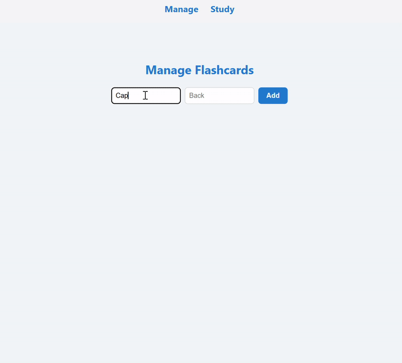

   

# Flashcards app

A simple flashcards app made with Django and React. It's a simple app that allows you to create flashcards and study them. Next is a demo of how the app works.



## Workflow (made with [draw.io](https://app.diagrams.net/))


## Run with Docker:

In order to run the app, you need to have Docker installed and running. Then, you can run the app with the following command:

```
docker compose up --build -d
```